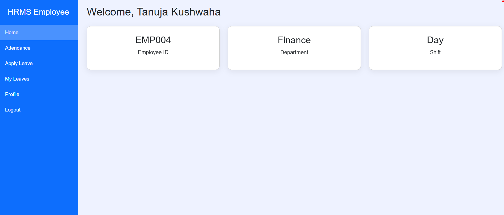
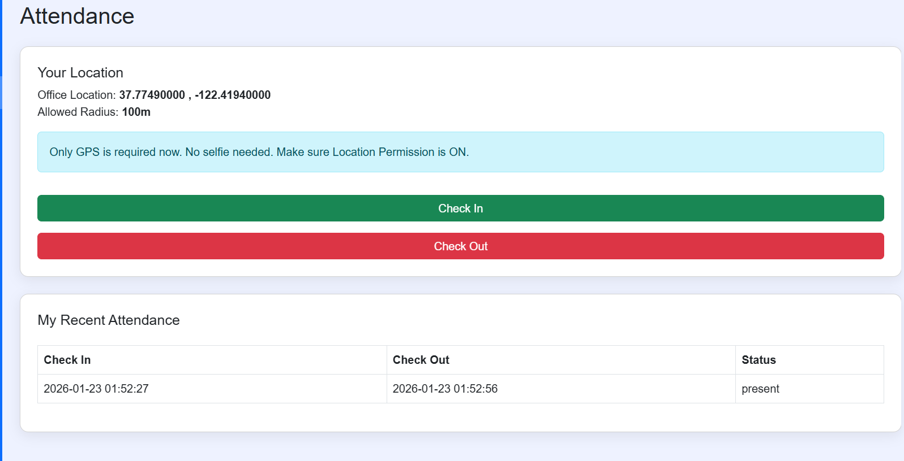

# Employee Attendance Management HRM

This project is an Employee Attendance Management System developed using PHP and MySQL to manage employee attendance and HR operations efficiently.

## Features
- Employee Management (Add, Edit, Delete)
- Attendance Tracking
- Leave Management
- Admin Dashboard
- Notification System
- Login Authentication

## Technologies Used
- PHP
- MySQL
- HTML
- CSS
- JavaScript
- Bootstrap

## Database Setup
Import the `database.sql` file into MySQL before running the project.

## Author
Tanuja Kushwaha

## Project Screenshots

### Dashboard

### Attendance Record

### Employee List

### Leave Request

